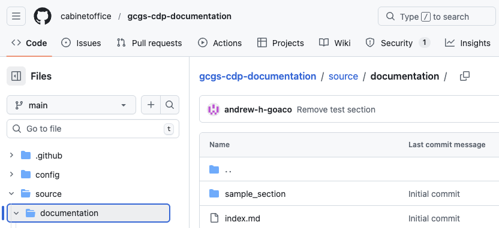
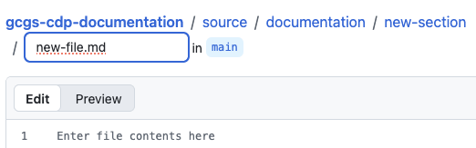
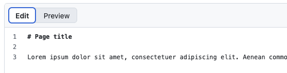
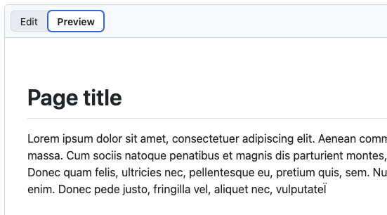
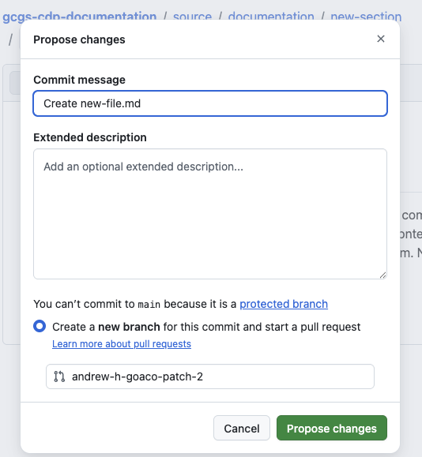
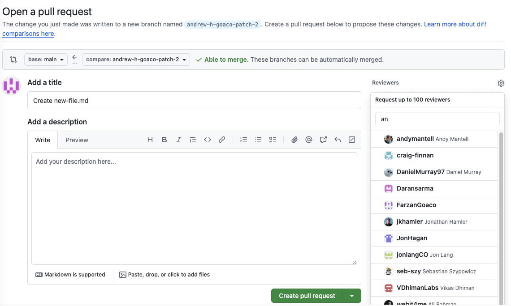
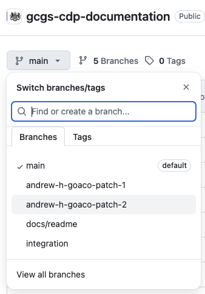
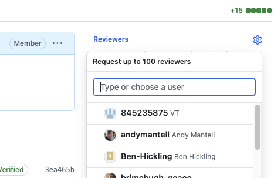

# Technical Documentation

## This project

This project provides a statically generated website for publishing technical documentation.

It enables content editors to create, manage, and update documentation through a structured content workflow, while delivering fast, secure, and scalable static pages to users.

🌐 Live site: https://guidance.cabinetoffice.gov.uk/gcgs-cdp-documentation/

## Credits

This project is based on
[alphagov / datagovuk-tech-docs](https://github.com/alphagov/datagovuk-tech-docs).

## Users and roles

This site supports two primary user roles, each with distinct responsibilities in the documentation publishing workflow.

- **Content editors** — create, update, and manage documentation content.
- **Content approvers** — review content and approve it for publication.

For more detailed information about each role:

- [Content editors](#content-editors)
- [Content approvers](#content-approvers)

## Content editors

### What do I need to add content?

As a content editor, there are no specific requirements or software installation instructions. All you need is access to a web browser and a basic understanding of the [GitHub UI](https://github.com/).

There are three basic steps involved:

1. [Add your content](#how-do-i-add-content)
1. [Add navigation to your content](#add-navigation-to-your-content)
1. [Submit your content for review/approval](#submit-content-for-approval)

### How do I add content?

#### Step 1 - Navigate to the [**gcgs-cdp-documentation** repo](https://github.com/cabinetoffice/gcgs-cdp-documentation) and log in using your authorised GitHub user account.

#### Step 2 - Select the `Code` tab at the top of the repository page

   

#### Step 3 - In the repository file list, navigate to the `/source/documentation/` folder.

   
   
#### Step 4 - Select `Add file` -> `Create new file`

   

#### Step 5 - You are presented with the folder/file name input box:

   

#### Step 6 - In the input box, type the folder path where your content should live,

followed by the file name:

- User forward slashes `/` to create folders (e.g. `new-section/`)

   

#### Step 7 - Enter and preview your content in the markdown edit / preview window.

   

   
   
#### Step 8 - Commit your changes by selecting `Commit changes...`

   

#### Step 9 - Leave the default commit message and branch name unchanged, optionally add a short description, then select `Propose changes...`.

- Make note of the branch name for later use

   

#### Step 10 - When prompted to open a pull request, leave the default title and optionally add a short description. **Do not assign a reviewer until all files have been added to this branch.**

   

### Step 11 - Create your pull request by selecting `Create pull request`


### Step 12 - With your pull request now created, it is time to add your navigation to your content

---

### How do I add navigation to my content?

#### Step 1 - Select the `Code` tab at the top of the repository page

   

#### Step 2 - Select your newly created branch from the branch list, identified by `main`:

   
 
### Step 3 - In the repository file list, navigate to the `/source/` folder.

   
   
#### Step 4 - Select `Add file` -> `Create new file`

   

#### Step 5 - You are presented with the folder/file name input box:

   

#### Step 6 - In the input box, type the folder path where your navigation should live,

followed by the file name:

- User forward slashes `/` to create folders (e.g. `new-section/`)

   

#### Step 7 - Enter the following content in the markdown edit window, ensuring the `partial` statement's path reflects the path to the content file you created earlier:

- Do not include the file's .md file ending)

   

#### Step 8 - Commit your changes by selecting `Commit changes...`

   

#### Step 9 - Leave the default commit message, branch selection and optionally add a short description, then select `Commit changes...`.

   

#### Step 10 - With your pull request now created, it is time to submit your content for approval.

---

### How do I submit my content for approval?

#### Step 1 - Select the `Pull requests` tab at the top of the repository page

   

#### Step 2 - In the list of pull requests, select your pull request.

   

#### Step 3 - Select the `Settings` (⚙) icon next to `Reviewers` to choose a reviewer.

   

#### Step 5 - With your pull request now assigned to a reviewer, await their feedback.


## Content approvers

TODO

## Development setup

This site is built using [**govuk_tech_docs 3.5.0**](https://github.com/alphagov/datagovuk-tech-docs).

Dependencies are intentionally locked to ensure reproducible builds. Please note:

- Ruby version is pinned in `.ruby-version` (Ruby **3.2.2**)
- Gem versions are locked in `Gemfile.lock`
- Always run commands via Bundler

```bash
bundle exec middleman server
```
