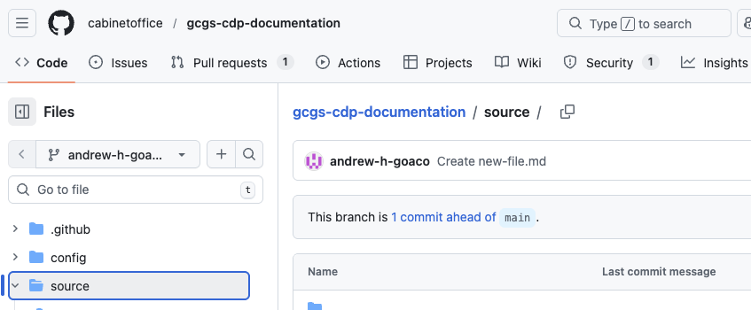
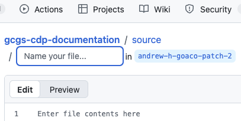
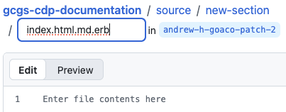
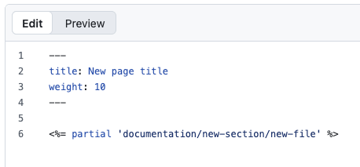
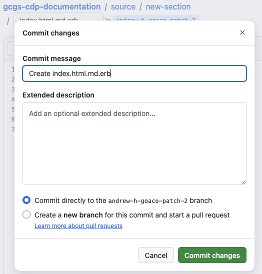

# Edit navigation

Start edit → Edit content → Start edit navigation → **Edit navigation**→ Preview content → Request review

This guide shows, for an existing content page, how to:
* Create a new navigation link page
* Edit an existing navigation link page
* Remove an existing navigation link page
 
## Step 1 - In the repository file list, navigate to the `/source/` folder.

   
   
## Step 2 - Select `Add file` -> `Create new file`

   

## Step 3 - You are presented with the folder/file name input box:

   

## Step 4 - In the input box, type the folder path where your navigation should live,

followed by the file name:

- User forward slashes `/` to create folders (e.g. `new-section/`)

   

## Step 5 - Enter the following content in the markdown edit window, ensuring the `partial` statement's path reflects the path to the content file you created earlier:

- Do not include the file's .md file ending)

   

## Step 6 - Commit your changes by selecting `Commit changes...`

   

## Step 7 - Leave the default commit message, branch selection and optionally add a short description, then select `Commit changes...`.

   

Continue to the next guide to preview your content.

---

← Back to [Start edit navigation](./03-start-edit-navigation.md)

Next → [Preview content](./05-preview-content.md)