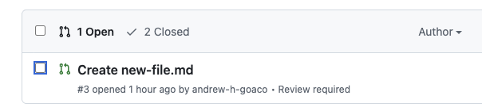
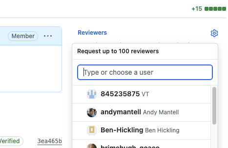

# Request review

Start edit → Edit content → Start edit navigation → Edit navigation → Preview content → **Request review**

This guide shows how to:
* Open your pull request
* Add reviewers

## Step 1 - Open your pull request

Switch to the Pull requests tab and open the pull request you created earlier.
   
   

## Step 2 - Add reviewers

On the right hand side of the pull request page, locate the **Reviewers** section
Select the gear icon and choose one or more reviewers

   

GitHub automatically notifies the selected reviewers

Your pull request is now ready for review.

A reviewer will check your changes before they are published to the web site.

---

← Back to [Preview content](./05-preview-content.md)
