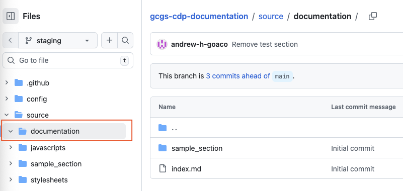
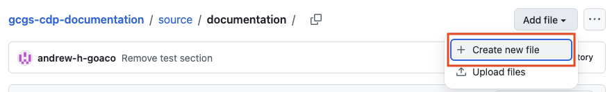
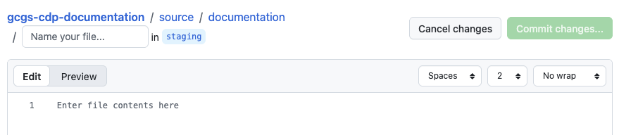
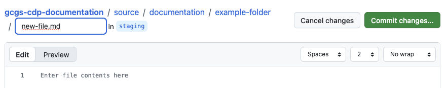
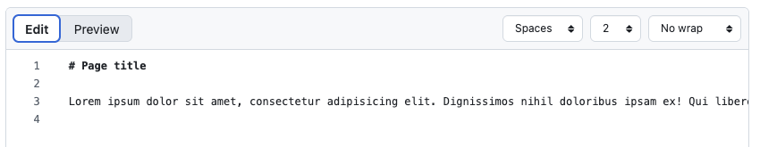
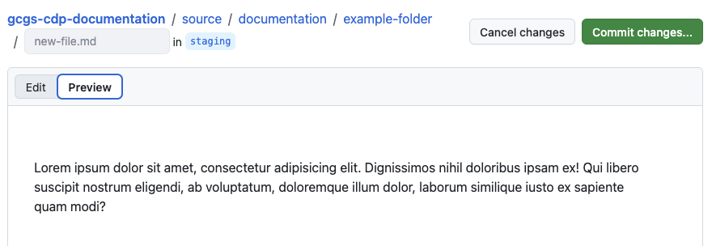
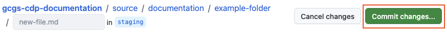
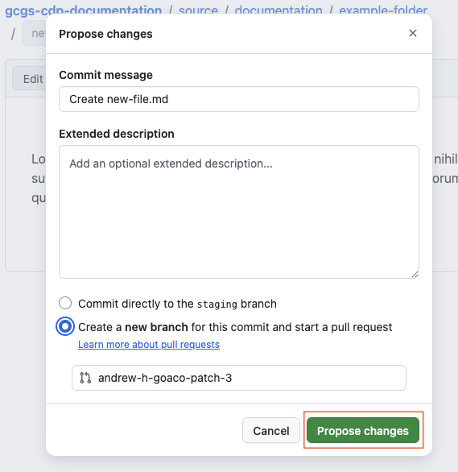
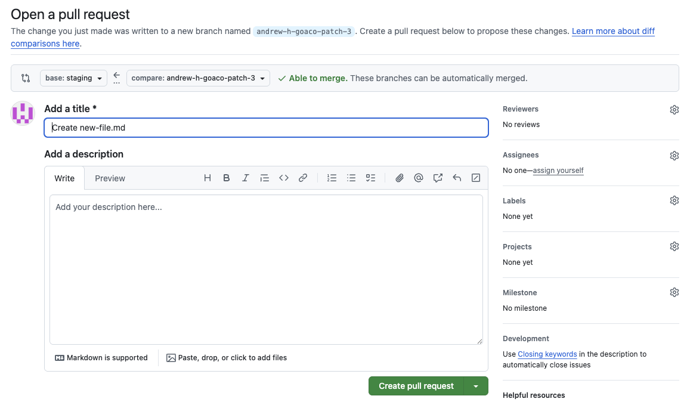

# Edit content

Start edit → **Edit content** → Start edit navigation → Edit navigation → Preview content → Request review

This guide shows how to:

- [Create a new page](#create-a-new-page)
- [Edit an existing page](#edit-an-existing-page)
- [Remove an existing page](#remove-an-existing-page)

## Create a new page

### Step 1 - Navigate to the correct content folder

In the Files view, open `/source/documentation/`, which contains the site's content folders and pages.

   
Show screenshot

   

### Step 2 - Create a new page

Select `Add file`, then `Create new file`.

   
Show screenshot

   

The file editor opens with a file name field at the top.

   
Show screenshot

   

Enter the name of the content file (**must end with .md file extension**).

To create a folder, include the folder name followed by / before the file name.

`e.g. example-folder/new-file.md`

   
Show screenshot

   

### Step 3- Enter and preview your content

In the markdown edit window, enter your markdown content.

   
Show screenshot

   

   
Then preview your content in the preview window.

   
Show screenshot

   

   
### Step 4 - Commit your changes to the repository

Select `Commit changes...` to save your changes to the repository.

   
Show screenshot

   

GitHub automatically creates a new branch for your changes.

Leave the default commit message and branch name unchanged, but **make a note of the new branch name**.

If needed, add more detail in the extended description field.

Select `Propose changes`.

   
Show screenshot

   

### Step 5 - Create your pull request

GitHub automatically opens the **Open a pull request** page.

Leave the default title unchanged and add a description of your changes.

Select `Create pull request`

    
Show screenshot

    

Your pull request has now been created.

## Edit an existing page
Coming soon.

## Remove an existing page
Coming soon.

---

Continue to the next guide to start editing your site navigation.

← Previous [Start editing](../01-start-edit-content/index.md)

Next → [Start edit navigation](../03-start-edit-navigation/index.md)
