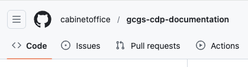
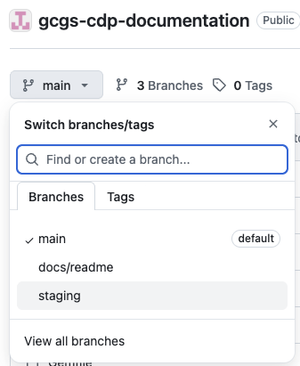

# Start edit navigation

Start edit → Edit content → **Start edit navigation** → Edit navigation → Preview content → Request review

This guide shows how to:
* Open the repository `Code` view
* Select the branch that contains your edited content

## Step 1 - Switch to the `Code` tab

Select the Code tab at the top of the repository to view the repository files and branches.

   
Show screenshot

   

## Step 2 – Switch to the branch that contains your edited content

Use the branch dropdown to switch to the branch that contains your edited content.

   
Show screenshot

   

---

>Continue to the next guide to edit your site navigation.

← Back to [Edit content](../02-edit-content/index.md)

Next → [Edit navigation](../04-edit-navigation/index.md)