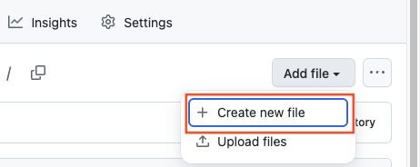
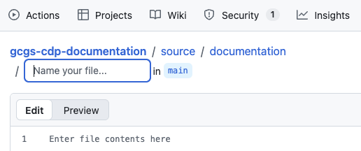

# Edit navigation

Start edit → Edit content → Start edit navigation → **Edit navigation**→ Preview content → Request review

This guide shows, for an existing content page, how to:

- [Create a new navigation link page](#create-a-new-navigation-link-page)
- [Edit an existing navigation link page](#edit-an-existing-navigation-link-page)
- [Remove an existing navigation link page](#remove-an-existing-navigation-link-page)

## Create a new navigation link page

### Step 1 - Navigate to the correct navigation link folder

In the Files view, open `/source/`, which contains the site's navigation link folders and pages.

#####Step 2 - Create a new navigation link page

Select `Add file`, then `Create new file`.

   
Show screenshot

   

The file editor opens with a file name field at the top.

   
Show screenshot

   

Ensure the name of the navigation file link is set to `index.html.md.erb`.

To create a folder, include the folder name followed by / before the file name.

`e.g. example-folder/index.html.md.erb`

   
Show screenshot

   <

### Step 3- Enter your navigation link

In the markdown edit window, enter your markdown navigation link data.

- `weight` - the ordering of the link within the navigation section.

Ensure the `partial` statement's path reflects the path to the content file you created earlier (excluding the .md file extension).

   
Show screenshot

   

### Step 4 - Commit your changes to the repository

Select `Commit changes...` to save your changes to the repository.

   
Show screenshot

   

GitHub shows the Commit changes confirmation window.

Leave the default commit message and branch name unchanged.

Select `Commit changes`.

   
Show screenshot

   

## Edit an existing navigation link page
Coming soon

## Remove an existing navigation link page
Coming soon

---

>Continue to the next guide to preview your content.

← Back to [Start editing](../03-start-edit-navigation/index.md)

Next → [Preview content](../05-preview-content/index.md)
