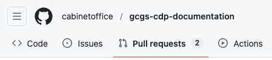
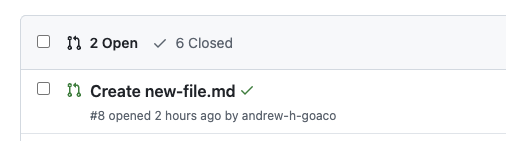
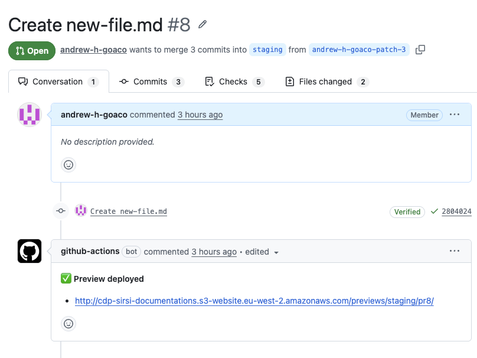
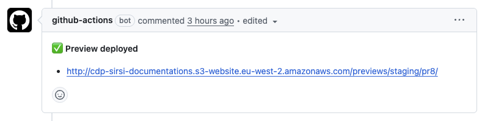
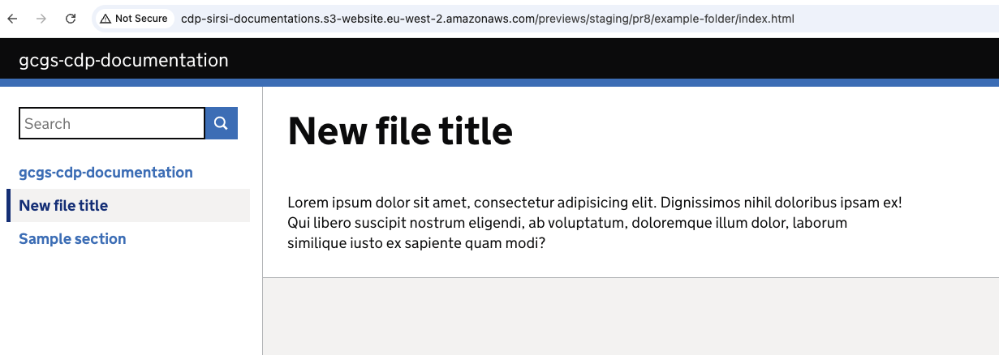

# Preview content

Start edit → Edit content → Start edit navigation → Edit navigation → **Preview content** → Request review

This guide shows how to:
* Open your pull request
* Open the preview site
* Review your changes

## Step 1 - Switch to the `Pull requests` tab

Select the `Pull requests` tab at the top of the repository to view all pull requests.

    
Show screenshot

    

## Step 2 - Switch to your pull request

Switch to the pull request created earlier by selecting its title.

    
Show screenshot

    

GitHub displays the pull request.

    
Show screenshot

    

## Step 3 - Open the preview site

Locate the comment titled `Preview deployed`, then select the preview link contained within it.
   

    
Show screenshot

    

## Step 4 - Review your changes

Review the preview site to confirm that your changes appear correctly.

    
Show screenshot

    

**If changes are required**

Update your content or navigation and preview again
* [Return to Edit site content](../01-start-edit-content/index.md)
* [Return to Edit site navigation](../03-start-edit-navigation/index.md)

---

>Continue to the next step to request a review

← Previous [Edit navigation](../04-edit-navigation/index.md)

Next → [Request review](../06-request-review/index.md)
