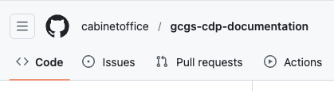

# Preview content

Start edit → Edit content → Start edit navigation → Edit navigation → **Preview content** → Request review

This guide shows how to:
* Open your pull request
* Open the preview site
* Review your changes

## Step 1 - Switch to the `Pull requests` tab

Select the `Pull requests` tab at the top of the repository to view all pull requests.

    
Show screenshot

    

## Step 2 - Switch to your pull request

Select to the pull request created earlier.

    
Show screenshot

    

GitHub displays the pull request.

## Step 2 - Open the preview site

Locate the comment titled `Preview deployed`, then select the preview link contained within it.
   

    
Show screenshot

    

## Step 3 - Review your changes

Review the preview site to confirm that your changes appear correctly.

    
Show screenshot

    

**If changes are required**

Update your content or navigation and preview again
* [Return to Edit site content](../01-start-edit-content/index.md)
* [Return to Edit site navigation](../03-start-edit-navigation/index.md)

---
**If the preview looks correct**

Continue to the next step to request a review

---

← Back to [Edit navigation](../04-edit-navigation/index.md)

[Request review](../06-request-review/index.md)
