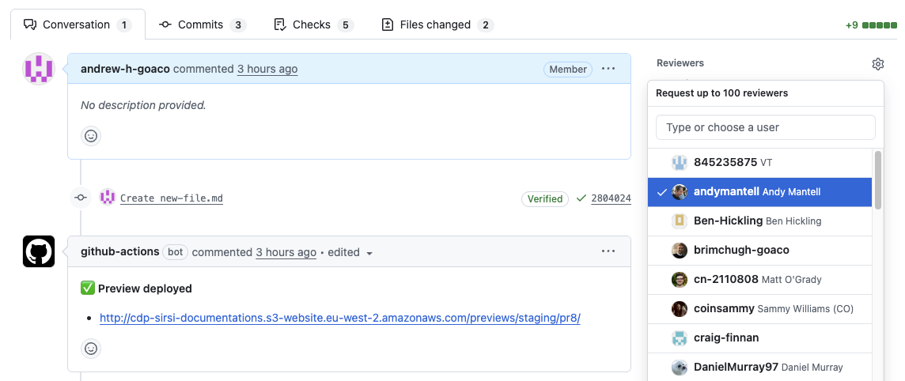

# Request review

Start edit → Edit content → Start edit navigation → Edit navigation → Preview content → **Request review**

This guide shows how to:
* Open your pull request
* Add reviewers

## Step 1 - Switch to the `Pull requests` tab

Select the `Pull requests` tab at the top of the repository to view all pull requests.

    
Show screenshot

    

## Step 2 - Switch to your pull request

Switch to the pull request created earlier by selecting its title.

    
Show screenshot

    

GitHub displays the pull request.

    
Show screenshot

    

## Step 3 - Add reviewers

On the right hand side of the pull request page, locate the **Reviewers** section.

Select the gear icon and choose one or more reviewers.

    
Show screenshot

    

GitHub automatically notifies the selected reviewer(s).

---

>A reviewer will check your changes before they are approved and published to the website.

← Previous [Preview content](../05-preview-content/index.md)
